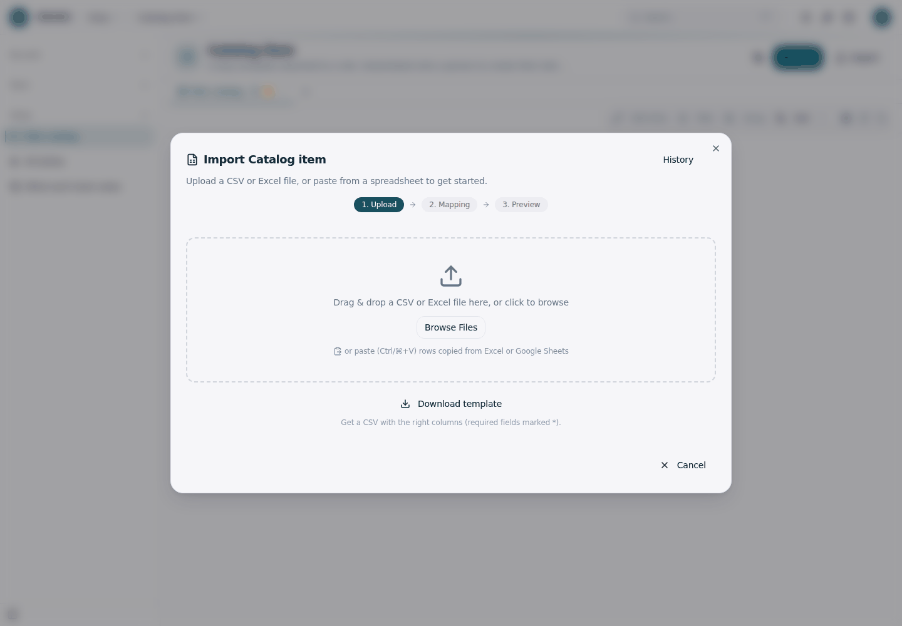
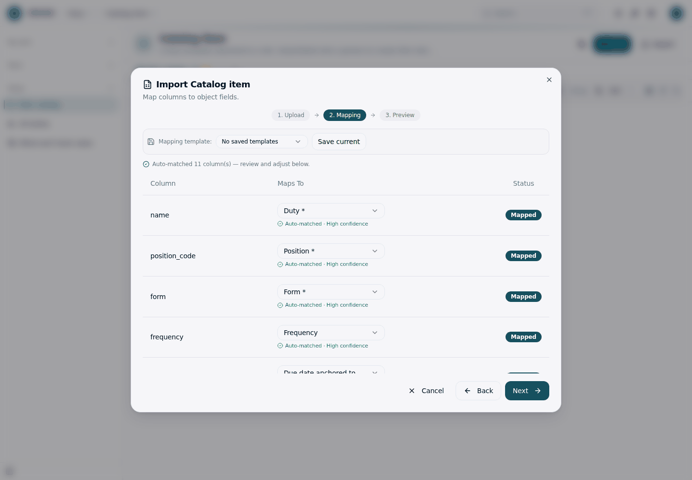
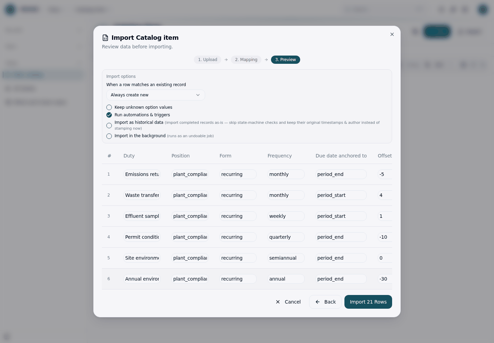
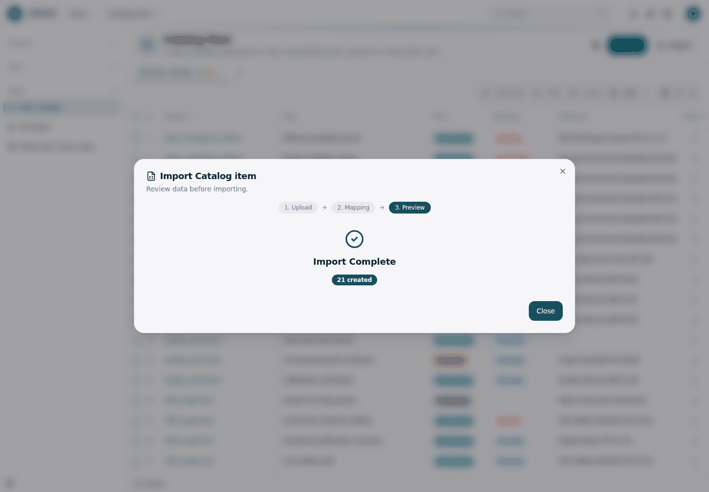
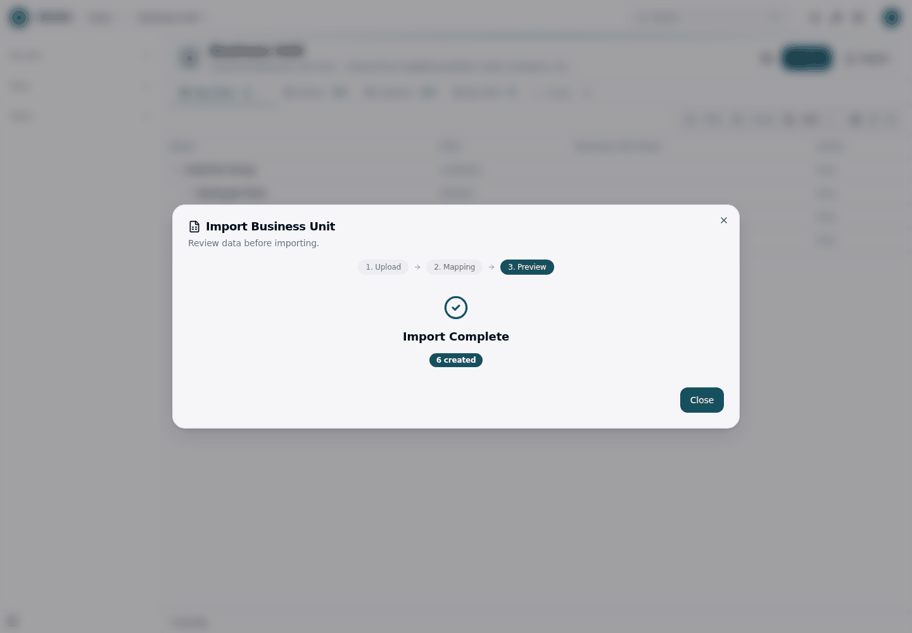
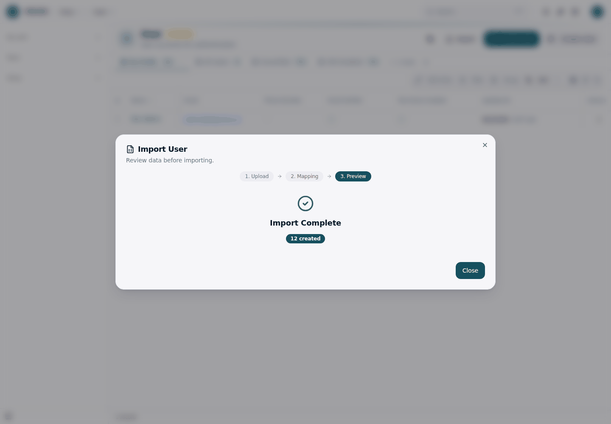
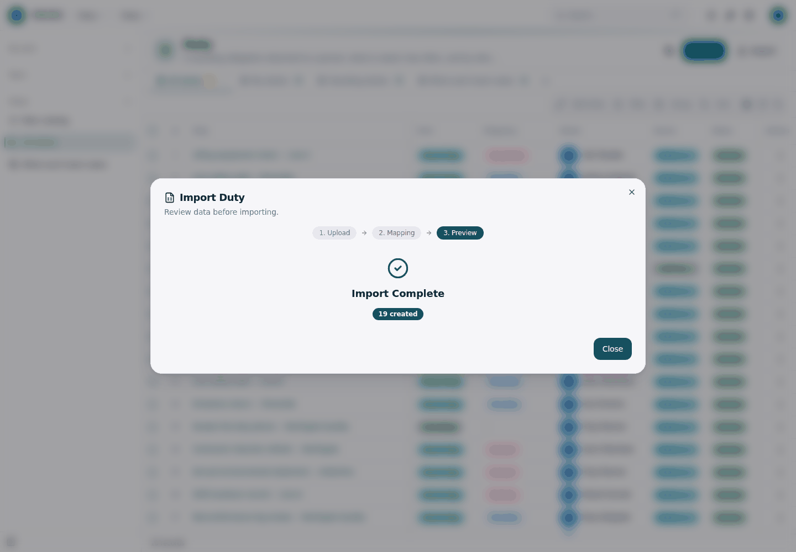
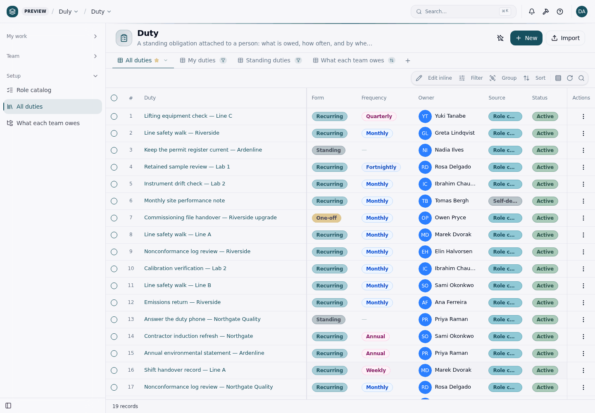
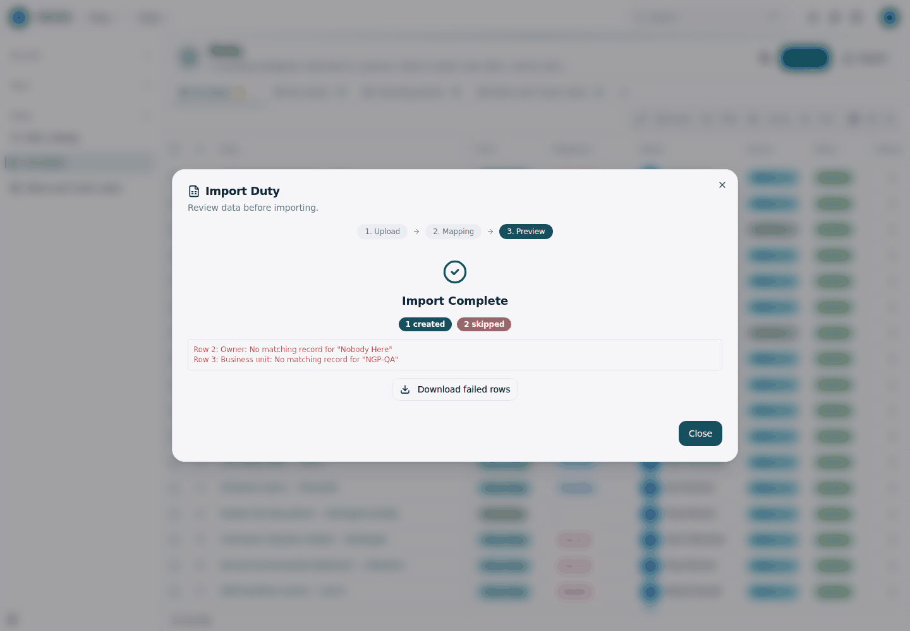

# Importing an existing duty list — the recorded walk

What a pre-sales demo of "import the list you already have" actually looks
like, screen by screen, and what the platform's Import was **measured** to do
with each column.

Duly writes no import code. The **Import** button on every object list is the
platform's (`@objectstack/connector-rest` 17.2.0); everything below is that
button, driven in a browser against a clean database.

- **Recorded on:** `pnpm dev` (not `pnpm demo` — see [Why a clean
  database](#why-a-clean-database)), fresh `.objectstack/data`, signed in as
  the seeded `admin@objectos.ai`.
- **Files:** the four CSVs in [`samples/`](../../samples).
- **Result:** 6 + 12 + 21 + 19 rows, `0 skipped`.

---

## The wizard

Three screens, identical on every object.

### 1. Upload

`Drag & drop a CSV or Excel file here` — plus a **Download template** link that
emits a CSV with the object's columns, required ones marked `*`.



The template writes **labels** as headers (`Duty *`, `Offset (days, 0 = anchor
day)`). The samples in this repo write **API names** (`name`,
`due_offset_days`) instead — both auto-match, and API names are stable across
locales, which is why the samples use them.

### 2. Mapping



`Auto-matched 11 column(s)` for `catalog-items.csv` and 14 for `duties.csv` —
every column, all at *High confidence*, nothing to adjust by hand.

Two statuses are worth knowing, because both mean "this column will not be
written" and neither is an error:

| Shown as | Example | Meaning |
|:---|:---|:---|
| `— Skip —` / `Skipped` | `sys_user.manager_id` | The column cannot be mapped at all. The row still imports, without it. |
| `… (match only)` | `duly_duty.last_dispatched_period` | Mappable as a *match key* for update/upsert, never written. Measured: the import reported `1 created` and the column read back `null`. |

Both are read-only fields. **A skipped column is the quiet failure mode this
whole page exists to make loud** — the import succeeds, the records land, and
one column is simply blank. `test/import-samples.test.ts` fails the build if a
sample header ever stops naming a writable field.

### 3. Preview



The parsed rows, plus the import options. The one that matters for a repeat
run:

**When a row matches an existing record** — `Always create new` (the default),
`Update existing (skip if no match)`, `Update if matched, else create`. On the
default, running the same file twice gives you two copies. Re-importing over an
earlier load means picking one of the other two and matching on `name`.

The button is labelled with the count: `Import 21 Rows`.

### Result



---

## The four files, in order

Order is not a style preference. Each file's lookups resolve against rows the
previous file created.

### 1 · Business units — `samples/business-units.csv` → `sys_business_unit`

Setup → People & Organization → **Business Units** → Import.



`parent_business_unit_id` is written as the **parent's name**, and resolves
*within the same file* — `Northgate Plant` finds `Ardenline Group` from a row
above it. (The importer flushes pending creates and retries a miss on the same
object, so a child after its parent is safe.)

### 2 · People — `samples/people.csv` → `sys_user`

Setup → People & Organization → **Users** → Import.



Name and email only. These are **directory rows, not logins** — nobody can sign
in as them. Real people get invited through Setup → Users → Invite User.

`manager_id` is deliberately **not** a column: it is read-only and the mapping
step drops it to `— Skip —`. Set the reporting chain in Setup, not in the CSV.

### 3 · Role catalog — `samples/catalog-items.csv` → `duly_catalog_item`

Duly → Setup → **Role catalog** → Import. 21 rows, no lookups at all — this
file imports into an otherwise empty database.

### 4 · Duties — `samples/duties.csv` → `duly_duty`

Duly → Setup → **All duties** → Import. Three lookups per row, all by natural
key.





Every `owner` resolved to a person, every `business_unit` to a unit, every
`catalog_item` to a template — read back through the API to confirm it is the
right row and not merely *a* row:

```
Lifting equipment check — Line C   owner=Yuki Tanabe   bu=Northgate Operations   catalog_item=Lifting equipment check
Keep the permit register current — Ardenline   owner=Nadia Ilves   bu=Ardenline Group   catalog_item=Keep the permit register current
Monthly site performance note   owner=Tomas Bergh   bu=Northgate Plant   catalog_item=null
```

---

## How lookups resolve — measured, not assumed

The importer tries, in order: an exact `id`, the target object's display field,
then `name`, `title`, `label`, `full_name`, `email`, `username`. The first
field to match wins; **more than one match stops the row rather than linking
the first**.

| Column | Target | Write it as | Measured |
|:---|:---|:---|:---|
| `duly_duty.owner` | `sys_user` | the person's **name** (`Priya Raman`) | resolves |
| `duly_duty.owner` | `sys_user` | their **email** (`priya.raman@ardenline.example`) | resolves |
| `duly_duty.business_unit` | `sys_business_unit` | the unit's **name** (`Northgate Quality`) | resolves |
| `duly_duty.business_unit` | `sys_business_unit` | the unit's **code** (`NGP-QA`) | **does not resolve** |
| `duly_duty.catalog_item` | `duly_catalog_item` | the item's **name** | resolves |
| `sys_business_unit.parent_business_unit_id` | `sys_business_unit` | the parent's **name** | resolves, same file |

**This is the same rule the seed loader uses.** `src/data/org.seed.ts` resolves
`duly_task.owner` and `duly_duty.owner` as natural keys against `sys_user.name`;
the Import UI was the open question, and it matches. One format for both paths.

### When it does not resolve

The row is skipped and named. Nothing is guessed, nothing is left dangling.



```
Row 2: Owner: No matching record for "Nobody Here"
Row 3: Business unit: No matching record for "NGP-QA"
```

**Download failed rows** hands back just those rows, so a partial load is
finished by fixing that file and importing it again.

This is also exactly what happens if you skip steps 1 and 2. Measured, on a
genuinely clean database with one user (`Dev Admin`) and no business units:
`duties.csv` imports **0 created, 19 skipped**, one `Owner: No matching record`
per row. Loud, per-row, recoverable — but the people have to be there first.

---

## Blank cells and the conditional defaults

A blank cell means **"leave this field unset"**, not "write null". The object's
`defaultValue` then decides, which is what makes one flat CSV able to carry
three duty forms without tripping the cadence rules in
`src/objects/catalog-item.object.ts`:

| Row form | Blank cadence cells | Landed as |
|:---|:---|:---|
| `standing` | frequency, anchor, offset, lead, grace | all five `null` — `standing_no_frequency` and friends satisfied |
| `one_off` | anchor, offset, lead | `null`; `grace_days` keeps the authored value (a one-off's task has a real due date) |
| `recurring` | — | as written |

Measured over the 21 imported catalog items: `recurring` 18, `standing` 2,
`one_off` 1; frequencies daily 1, weekly 3, fortnightly 1, monthly 9,
quarterly 2, semi-annual 1, annual 2.

---

## Why a clean database

`pnpm demo` loads the same fictional organisation — Ardenline Group — as a
seed. Walking the import on top of it proves nothing: the rows are already
there, and with the default `Always create new` you get two of each.

`pnpm dev` starts empty, which is also what a real deployment starts from, so
the walk above is the customer's first hour rather than a demo of a demo.

```bash
rm -rf .objectstack/data
pnpm dev
```

## What is deliberately not here

- **No import handler, action or job.** The platform's Import is the interface.
  A Duly-specific import path would be a second dialect of a thing that already
  works.
- **No Excel parsing.** The platform's endpoint accepts `.xlsx` itself; CSV is
  what these samples ship as because it diffs.
- **No `sys_business_unit_member` rows.** Membership is what
  `sys_user.primary_business_unit_id` is derived from, and it is Setup's
  surface, not this walk's — `duly_duty.business_unit` is written directly from
  the CSV and does not depend on it.
